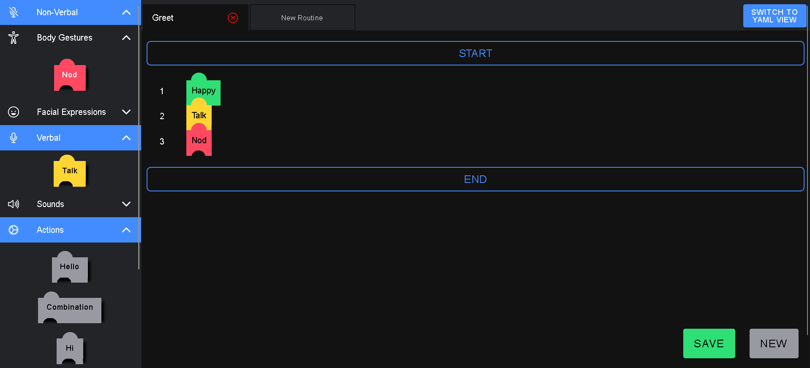
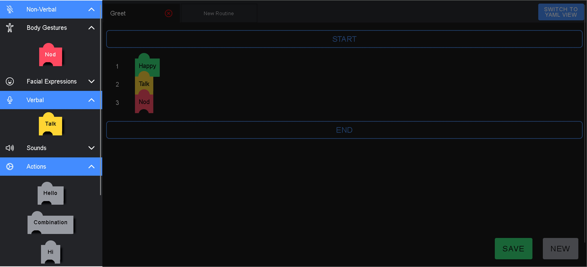
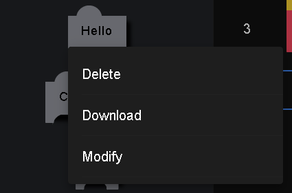
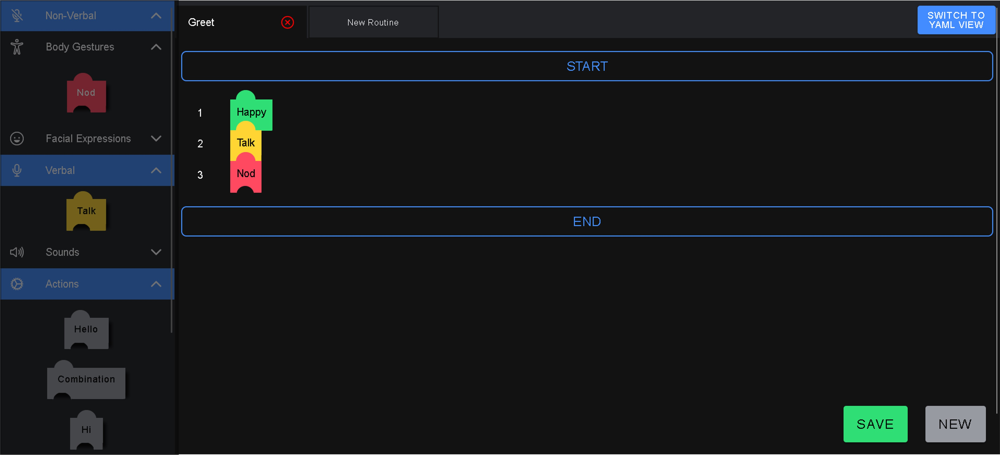

# Routine Building App - User Manual - Localhost

This project was generated with [Angular CLI](https://github.com/angular/angular-cli) version 16.2.0.

## Installation

Make sure the device has AngularCLI installed. This instructions can be followed to install this version. 
COARS
MongoDB

## Conecting to the database

## Usage

The app has 2 distinct areas, the sidebar where all of the available blocks are displayed, and the routine building area.

### Sidebar

The sidebar is an accordeon-type collection of blocks which are distributed in 3 groups:
* Non-Verbal: which include all of the actions that can be performed by the robot
  *  Body Gestures: Movements performed by the body of the robot
  *  Facial Expressions: Animations that can be presented in the screen of the robot
* Verbal: Which include all of the possible sounds that the robot can say through the speaker
* Actions: Previous curated routines

If you have doubts about a particular block, you can hover over any block and a small description is shown. And when right-clicking on an action block, a menu of options will display:

* Delete: Erases that routine from the current view and database
* Download: Will download the yaml file of that particular routine
* Modify: Will open a new tab with that rutine displayed

In the sidebar you can also find a underlined text <ins>Open Last Routine</ins>, which will open a new tab with the last opened routine.

### Routine window

Where you can build and modify routines to pass to a robot.

#### Tabs

On the top of the routine window, you can open multiple tabs. You can scroll through the tabs to edit different routine at the same time. You can also close tabs with the *x* button to the right of the tab. Make sure to save your routine before exiting tab as it will not save automatically.

#### Buttons

* **Switch to YAML view**: Will show the current routine as a text in yaml format. It will preview the yaml file that can be downloaded.
* **Save**: Will save the displayed routine in the database, if the name exists already then it will show a warning.
* **New**: Will open a new tab with a clean view to create a new routine.

### Building a routine

1. **Creating a New Routine:**
   - Drag and drop blocks from the sidebar to the routine building window on any tab.

2. **Setting Block Parameters:**
   - When you drop a block, a pop-up will appear to set its parameters.
   - Click **SAVE** in the pop-up to confirm and save the changes.

3. **Editing Block Parameters:**
   - To revisit a block's parameters, double-click on the block, and adjust as needed.

4. **Arranging Blocks:**
   - Rearrange blocks to dictate the order of actions for the robot.
   - Delete a block by dragging it outside the routine building area.

5. **Routine Management:**
   - Open a new tab or **Modify** an existing routine to edit it.

6. **Downloading Routine YAML File:**
   - Save the current routine > open a new tab > right-click on the routine's name in the sidebar > choose download.

7. **Concurrent Activities:**
   - Place multiple blocks in the same line to represent concurrent activities by the robot.

8. **Limitations on Actions in the Same Line:**
   - Only a single facial expression, body gesture, and verbal action can be placed in the same line.

9. **Exception for Verbal Actions:**
   - *Talk* is the only exception. You can place as many *Talk* blocks as you want in the same line, and they will be spoken in the order placed.

10. **Restrictions on Routine Blocks:**
    - Routine blocks cannot be placed in the same line as other blocks.

11. **Editing Subroutine Blocks:**
    - Double-click on dropped subroutine blocks in the routine window to edit them.

A simple demonstration can be seen bellow.
